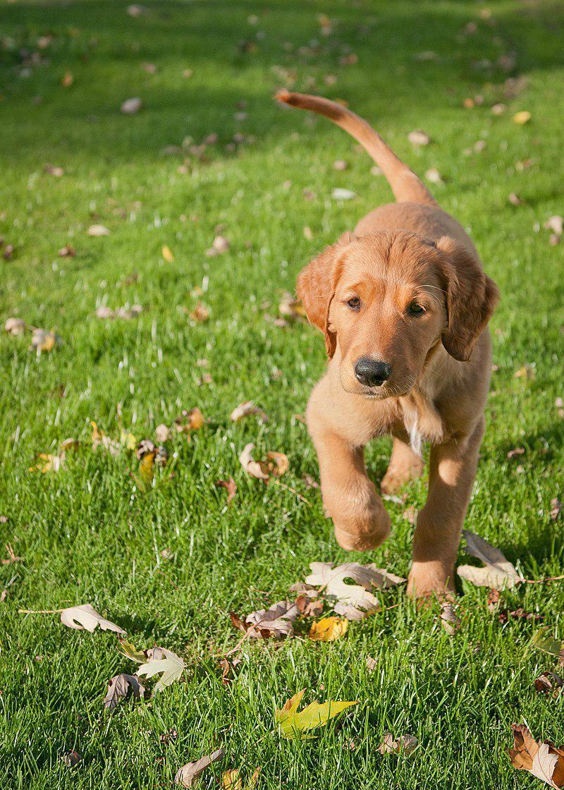
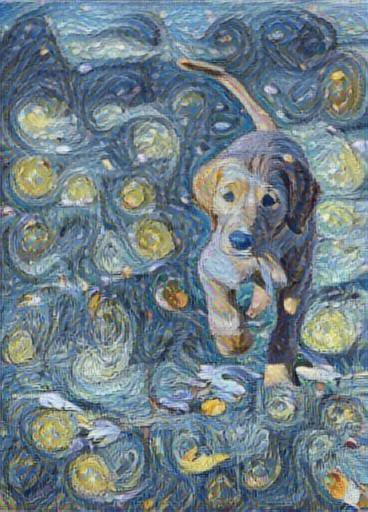
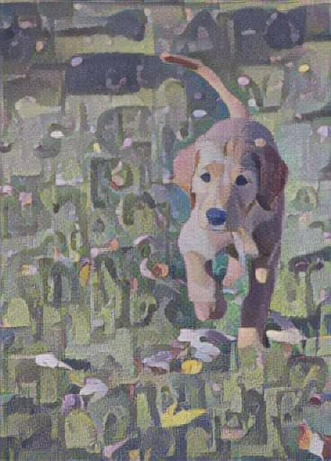
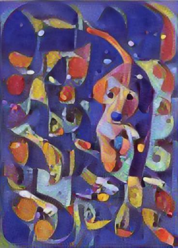
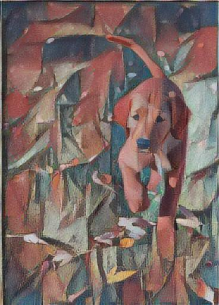
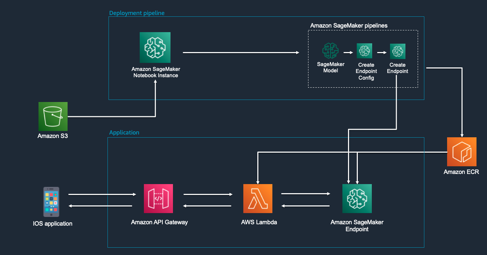
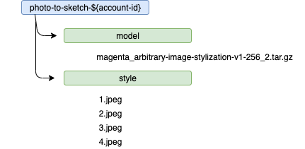

# Photo to Sketch

**Photo to Sketch: Your Artificial Street Artist in the Cloud**, showcase an ML use case that take pictures in an ios phone application and generate their sketched version. To accomplish it, it hosts a pre-trained Fast Arbitrary image style transfer model from TensorFlow in an Amazon SageMaker Endpoint. For further details on the pre-trained ML model, you can check it [here](https://tfhub.dev/google/magenta/arbitrary-image-stylization-v1-256/2).

## Authors 

- Feng Shi, Data Scientist
- Ke Li, ML Engineer/Data Scientist
- Lun Yeh, Data Scientist
- Naz Levent, Data Scientist
- Sandra Pico Oristrell, ML Engineer/Data Scientist

<small>*List of authors in alphabetical order by first name*</small>
## Outcome

As said, this project allows you to transform an original picture into an styled version by invoking the mentioned ML model through real-time inference. Find below how these styles look like:

- **Original picture**:



- **Style 1, Vincent van Gogh, The Starry Night**:



- **Style 2, Georges Seurat, A Sunday Afternoon on the Island of La Grande Jatte**:



- **Style 3, Vassily Kandinsky - In Blue**:



- **Style 4, Franz Marc - The Foxes**:



## Architecture

For this project, we are utilizing Amazon SageMaker endpoint to host the pre-trained ML model. At the same time, we are using Amazon API Gateway and AWS Lambda to invoke the endpoint and get the inference to our ios application. Find below the architecture diagram.



## Usage

To be able to run the project, follow the steps below.

### Set up Amazon S3 bucket

1. Create an Amazon S3 bucket in your AWS account. Name the bucket: photo-to-sketch-*${account-id}*, where account-id stands for your AWS Account Id.
2. Download the pre-trained ML model (tar.gz) from the following [link](https://tfhub.dev/google/magenta/arbitrary-image-stylization-v1-256/2). 
3. Upload the *magenta_arbitrary-image-stylization-v1-256_2.tar.gz* file under a */model* directory in the S3 bucket. 
4. Upload the 4 style images under */src/img/style* directory under a */style* directory in the S3 bucket. 

Find below an image on the expected S3 bucket structure.



### Run the code in an Amazon SageMaker Notebook Instance!

Create an Amazon SageMaker Notebook instance and clone this git repository. Under /src directory, you will find the notebook *style_transfer.ipynb*. Run the notebook from top to bottom to understand how our model works. 

### Set up API Gateway

If you would like to try to call our ML model using Amazon API Gateway, follow the steps below:

1. Go to the AWS Console > API Gateway > Create API. Specify that it is a REST API. Choose a nice name for your API such as photo-to-sketch.

2. When the API is created, create a resource named /apply. Under this resource, create a POST method with Integration Type being Lambda Function. Select "Use Lambda Proxy Integration". In the Lambda function field, add our Lambda function name: photo-to-sketch-inference-lambda-${account_id}, where account-id stands for your AWS Account Id. 

3. Now that we have the API Gateway configured with our Inference Lambda function, you can test your API from the AWS Console. Select POST method and click "Test". In Request Body, specify your JSON request following the expected format as below:
    ```
    {
        "image": "<Add your image encoded as base64>",
        "effectType": "1" or "2" or "3" or "4"
    }
    ```
You will get the styled image base64 encoded as a response for the API Gateway in the same console!

4. In case you would like to deploy an example of ios application that could utilize this project, find it under /application/ folder. 

## License images

/src/img/dog.jpeg
    By Bob Haarmans licensed with CC BY 2.0
    https://commons.wikimedia.org/wiki/Category:Dogs#/media/File:A_dog_-_6252881250.jpg

/src/img/style/1.jpeg
    Van Gogh's Starry Night. This image was licensed with CC BY 2.0
    https://www.davidson.edu/news/2021/04/16/immersive-van-gogh-has-upsides-and-downsides-explains-art-prof

/src/img/style/2.jpeg
    Georges Seurat, A Sunday Afternoon on the Island of La Grande Jatte
    This image was licensed with  Creative Commons Zero (CC0)
    https://www.artic.edu/artworks/27992/a-sunday-on-la-grande-jatte-1884

/src/img/style/3.jpeg
    Vassily Kandinsky, 1925 -In Blue
    This work is in the public domain in its country of origin and other countries and areas where the copyright term is the author's life plus 70 years or fewer.
    https://commons.wikimedia.org/wiki/File:Vassily_Kandinsky,_1925_-In_Blue.jpg

/src/img/style/4.jpeg
    Franz Marc - The Foxes
    The author died in 1916, so this work is in the public domain in its country of origin and other countries and areas where the copyright term is the author's life plus 100 years or fewer.
    https://commons.wikimedia.org/wiki/File:Franz_Marc_-_The_Foxes_-_Google_Art_Project.jpg


## Security

See [CONTRIBUTING](CONTRIBUTING.md#security-issue-notifications) for more information.

## License

This library is licensed under the MIT-0 License. See the LICENSE file.

